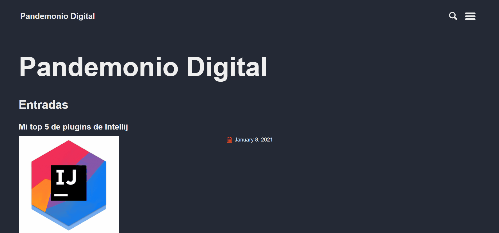

# Blog Pandemonio-Digital
[](https://opensource.org/licenses/MIT)

Language: [English](../README.md) | Español



# Comenzando 🚀
El principal propósito de este proyecto es realizar mi blog personal utilizando  **GitHub Pages** con **Jekyll**.

Para ello vamos a utilizar el tema [jekyll-theme-basically-basic](https://github.com/mmistakes/jekyll-theme-basically-basic).

# Pre-requisitos 📋
Es necesario tener instalado:

- Ruby version 2.4.0 or higher
- RubyGems
- GCC and Make

# Instalacion 🔧
Para instalar el proyecto hay que ejecutar el siguiente comando:

```bash
$bundle install
```

# Ejecutando el proyecto ⚙️
Para ejecutar el proyecto hay que ejecutar el siguiente comando:

```bash
$bundle exec jekyll server
```

